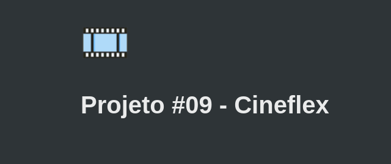

<h1 align="center">
    
</h1>

<h1 align="center">
    <a href="#">Cineflex</a>
</h1>

  
   
   

<h4 align="center"> 
	 Status: Delivered.
</h4>

## About

Cineflex is a quick and easy way to book movie tickets.  
Project developed during ** Bootcamp Responde Aí ** offered by [Responde Aí](https://www.respondeai.com.br/).  
The focus of this project is to further develop Front End skills and the concept of single-page applications, changing from pure JavaScript to React, using HTML5, CSS3 and React.

---

## Features

- [x] Mobile Layout

- [x] Homepage experience:

  - [x] Loads list of movies;
  - [x] Select any movie you like!

- [x] Movie sessions

  - [x] Displays available sessions, separated by weekdays and hour;
  - [x] Select the most convenient session for you!;

- [x] Selecting seats

  - [x] Displays seats, showing if it is available or not;
  - [x] Select how many seats you want;
  - [x] Input name and document;
  - [x] When finished, send purchase request;

- [x] Success page
  - [x] Displays success page with purchase informations;
  - [x] Back home button;

---

## Layout

The application layout is available on Figma:

### Mobile

  
  

  
  

## Tech Used

The following tools were used in the construction of the project:

- ****
- ****
- ****
- ****

#### **Utilities**

- Prototype: **[Figma](https://www.figma.com/)** → **[Protótipo (Cineflex)](https://www.figma.com/file/nCuPD1re0r4EAwNl7OCNvz/BuzzQuizz---Turma-02?node-id=0%3A1)**
- Editor: **[Visual Studio Code](https://code.visualstudio.com/)**
- Deploy: **[Vercel](https://vercel.com/)**
- Fonts: **[Roboto](https://fonts.google.com/specimen/Roboto)**, **[Bebas Neue](https://fonts.google.com/specimen/Bebas+Neue?preview.text=&preview.text_type=custom&query=Beb)**

---

## Authors

<a style="border-radius: 50px;" width="100px;" href="https://github.com/lucasmoraismt">
 
  
 <b>Lucas de Morais</b></a>
  

## 

## License

This project is under the license [MIT](./LICENSE).

👋🏽 Get in Touch!

---
